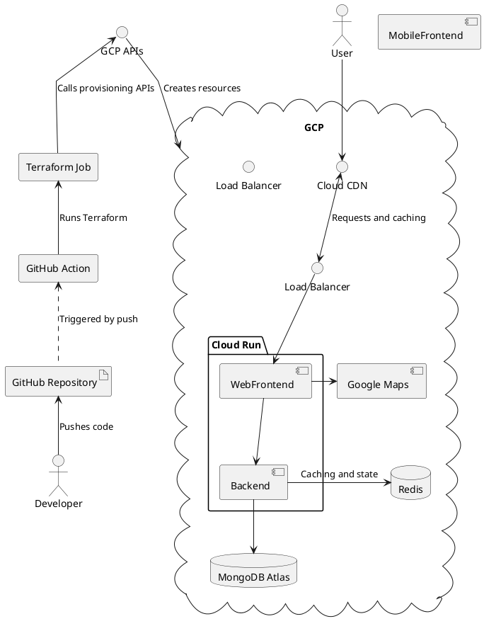

# Architecture

- The frontend app should be an app that can be installed on a phone or tablet or a PWA.
- The backend should be integrated into the Google Cloud Platform using Terraform and GitHub Actions.

## Diagram

Tools that we should implement:

- Cloud Secret Manager (+++)
- Cloud DNS (++)

Tools that might be relevant:

- Cloud Armor
- Cloud Identity (Cloud IAM)
- Cloud Operations Suite

Relevant for the report:

- Google Cloud Compute Engine
- Cloud functions
- Cloud Vision API
- Cloud Natural Language API
- Cloud ML
- Baremetal or on prem is not supported by our approach.
- Google Cloud Premium Network Tier (VPC) vs Google Cloud Standard Network Tier
  - Public Internet vs Cloud Interconnect
